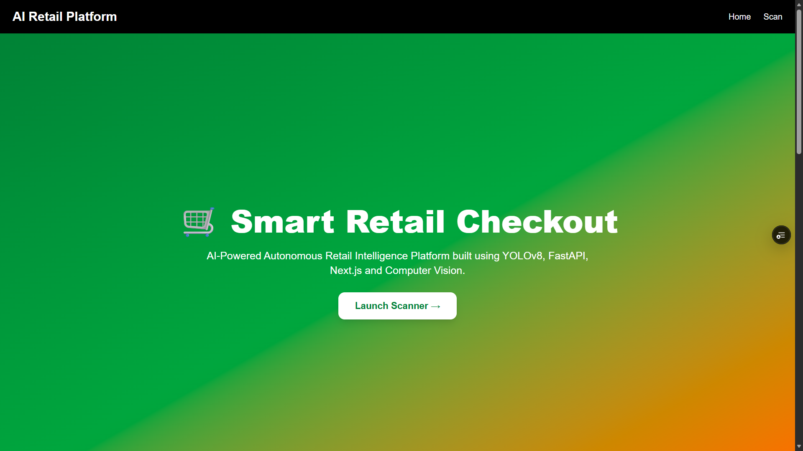
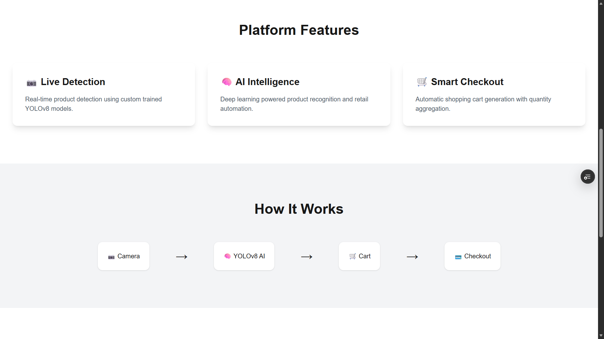
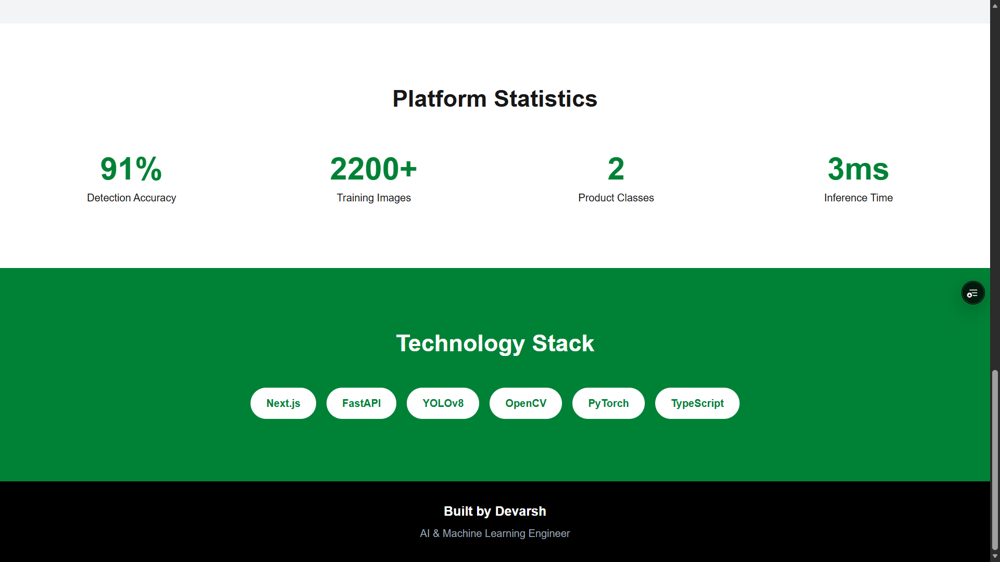
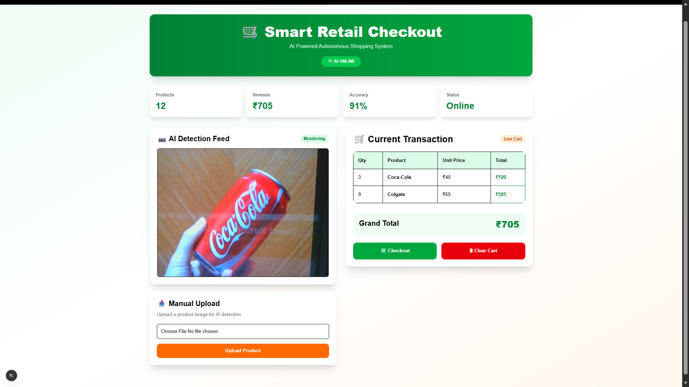
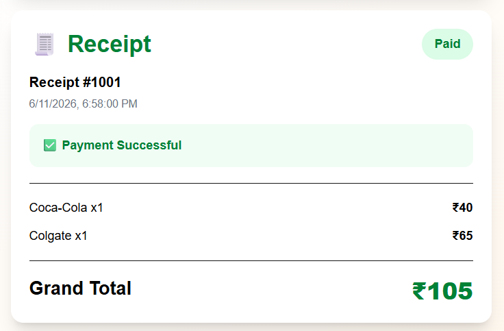

# 🛒 VisionCart

### AI-Powered Autonomous Retail Checkout System

VisionCart is a full-stack AI retail checkout platform that uses Computer Vision and Deep Learning to automatically identify products, generate shopping carts, and perform smart checkout operations in real time.

The platform combines a custom-trained YOLOv8 object detection model with a FastAPI backend and a Next.js frontend to deliver an intelligent retail experience.

---

## 📸 Application Screenshots

### Home Page





---

### Live Product Scanner



---

### Receipt Generation




## 🚀 Features

### Computer Vision

* Custom YOLOv8 object detection model
* Real-time product recognition
* Live camera scanning
* Image upload support
* Confidence-based predictions

### Smart Checkout

* Automatic cart generation
* Quantity aggregation
* Dynamic total calculation
* Checkout workflow
* Receipt generation

### Full-Stack Architecture

* Next.js frontend
* FastAPI backend
* REST API communication
* Real-time AI inference
* Responsive user interface

---

## 🏗️ System Architecture

```text
Camera / Image Upload
          │
          ▼
     Next.js Frontend
          │
          ▼
      FastAPI API
          │
          ▼
     YOLOv8 Detector
          │
          ▼
 Product Identification
          │
          ▼
 Shopping Cart Engine
          │
          ▼
 Checkout & Receipt
```

---

## 🧠 AI Model

### Model

* YOLOv8 Nano (YOLOv8n)

### Custom Classes

* Coca-Cola
* Colgate

### Training Details

* Custom retail dataset
* Data preprocessing and label conversion
* Multi-class object detection
* GPU-accelerated training

### Performance

| Metric    | Value |
| --------- | ----- |
| Precision | 92.9% |
| Recall    | 87.5% |
| mAP50     | 91.3% |
| mAP50-95  | 80.8% |

---

## 🛠️ Tech Stack

### AI / Machine Learning

* Python
* PyTorch
* YOLOv8
* OpenCV
* NumPy

### Backend

* FastAPI
* Uvicorn

### Frontend

* Next.js
* React
* TypeScript
* Tailwind CSS
* Framer Motion

### Development Tools

* Git
* GitHub

---

## 📂 Project Structure

```text
VisionCart
│
├── backend
│   ├── ai_services
│   ├── models
│   │   └── best.pt
│   ├── uploads
│   ├── main.py
│   └── requirements.txt
│
├── frontend
│   ├── src
│   ├── public
│   └── package.json
│
├── training
│   └── train.py
│
├── convert_colgate_labels.py
├── merge_datasets.py
├── README.md
└── .gitignore
```

---

## ⚙️ Installation

### Clone Repository

```bash
git clone https://github.com/DevarshSR/visioncart-ai.git
cd visioncart-ai
```

---

### Backend Setup

```bash
cd backend

python -m venv venv

venv\Scripts\activate

pip install -r requirements.txt

uvicorn main:app --reload
```

Backend URL:

```text
http://localhost:8000
```

---

### Frontend Setup

```bash
cd frontend

npm install

npm run dev
```

Frontend URL:

```text
http://localhost:3000
```

---

## 📸 Application Workflow

1. User opens VisionCart.
2. Camera feed starts automatically.
3. Product image is captured.
4. FastAPI sends image to YOLOv8 model.
5. Product is detected.
6. Cart is updated automatically.
7. User performs checkout.
8. Receipt is generated.

---

## 🎯 Future Enhancements

* Multi-product retail datasets
* Product tracking using ByteTrack
* Database integration
* Inventory management
* Cloud deployment
* Analytics dashboard
* Customer transaction history
* Mobile application

---

## 👨‍💻 Author

**Devarsh S R**

AI & Machine Learning Engineer

GitHub: https://github.com/DevarshSR

---

## 📜 License

This project is intended for educational, research, and portfolio purposes.
